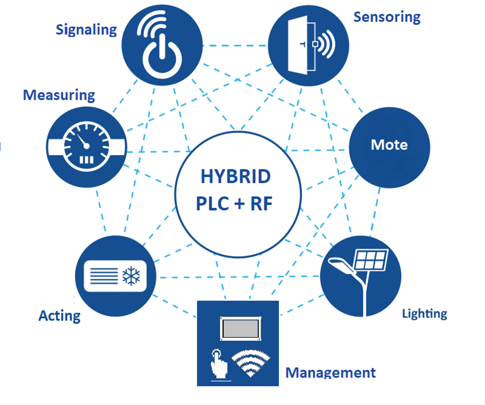
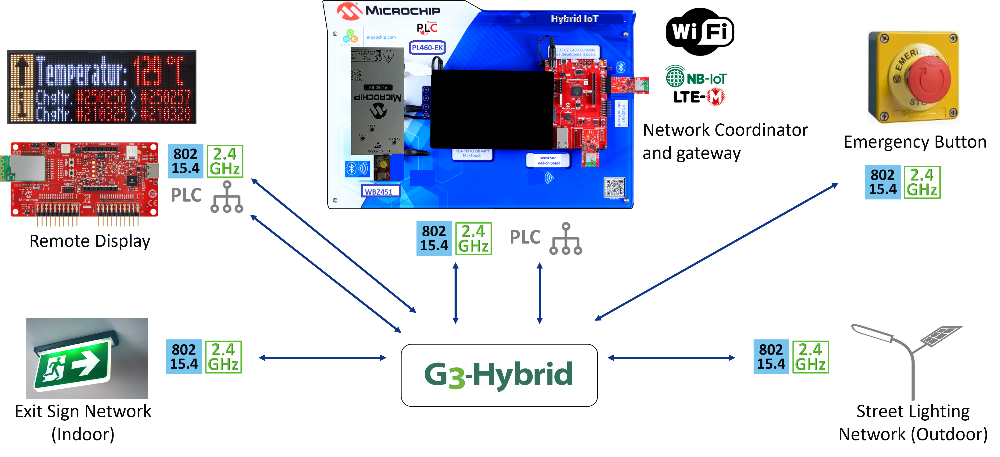

# G3_HYBRID_IOT_DEMO <!-- omit in toc -->

> "IoT Made Easy!" - This is an application using the unified G3-Hybrid PLC+RF protocol.

Devices: **| PIC32CX-BZ, AC320005-5, PIC32CZ CA80, WINCS02, GM02S |** 
Features: **| G3 Hybrid IoT (PLC + RF), LCD, Wi-Fi, LTE |**

## ⚠ Disclaimer <!-- omit in toc -->

<b>
THE SOFTWARE ARE PROVIDED "AS IS" AND GIVE A PATH FOR SELF-SUPPORT AND SELF-MAINTENANCE. This repository contains example code intended to help accelerate client product development.  

For additional Microchip repos, see: <a href="https://github.com/Microchip-MPLAB-Harmony" target="_blank">https://github.com/Microchip-MPLAB-Harmony</a>

Checkout the <a href="https://microchipsupport.force.com/s/" target="_blank">Technical support portal</a> to access our knowledge base, community forums or submit support ticket requests.

</b>

## Contents <!-- omit in toc -->
- [Introduction](#introduction)
- [Solution Diagram](#solution-diagram)
- [Run the demo](#run-the-demo)
- [Projects](#projects)
- [Related links](#related-links)

## Introduction

The increasing demand for connected, energy-efficient, and scalable Smart Grid and Smart City solutions requires communication systems that are both cost-effective and highly reliable. A promising approach to meet these requirements is the hybrid communication technology that combines Power Line Communication (PLC) with wireless mesh (RF) networks.

The objective of this hybrid solution is to reduce overall system costs by minimizing the number of data concentrators needed while increasing the number of smart meters managed by each unit. As a result, installation, operation, and maintenance costs can be significantly reduced.

This system leverages two field-proven technologies from Microchip: the PL460 G3-PLC modem for wired communication and the PIC32-BZ Wireless Mesh platform for robust IEEE 802.15.4-based RF connectivity. Together, these technologies enable 100% network coverage by seamlessly integrating wired and wireless communication segments.

The hybrid solution is particularly well-suited for smart metering, energy monitoring, and sensing applications, including consumption measurement, street lighting control, and solar panel grid integration. The solution is fully supported within MPLAB® Harmony 3, providing ready-to-use hybrid communication software components.

In addition, the system has been enhanced with advanced Microcontroller functions such as: Graphics (GFX), Capacitive Touch interface offering an easy way for local control, visualization and provisioning. Cloud Connectivity is enabled through Wi-Fi module and cellular modem that provides reliable LTE-M connectivity for industrial and commercial IoT applications.

By combining wired (G3-PLC) and wireless (15.4 RF Mesh) communication technologies, this hybrid approach delivers a sustainable, scalable, and future-ready connectivity platform for next-generation smart energy and infrastructure solutions.

[TOP](#contents)

## Solution Diagram

## Run the demo
### Roles <!-- omit in toc -->
- WBZ451 is used as coordinator creating the G3 network with hybrid connectivity (PLC + RF)
- WBZ451/WBZ451HPE are used as end devices with hybrid or RF only connectivity
- PIC32CZ CA80 Curiosity Ultra is used as host device, getting network data from the coordinator to showcase it on the display as well as an IoT Dashboard hosted on the Cloud updated via Wi-Fi and LTE-M connectivity

After powering up the demo, the coordinator is creating the G3 Network. G3 devices start to discover networks around and join the network offering the best link quality. The Host MCU device should receive the network data from the coordinator and make them available locally on the display and remotely by publishing MQTT messages to the IoT Dashboard.

The following end devices are part of the demo:
- Matrix LED display node
- Emergency Push Button node
- Indoor light node
- Outdoor light node
- Sustainability wall devices containing:
  - Liquid Detection
  - Solar Microinverter
  - Solar MPPT Battery Charger
  - Energy Storage
  - Heat Pump
  - EV Charger
  - Electricity Meter

[TOP](#contents)

## Projects

| Projects                                                                                    | Device(s)                                                                                                            |
| :------------------------------------------------------------------------------------------ | :------------------------------------------------------------------------------------------------------------------- |
| G3 network coordinator (WBZ451) - [g3_coordinator_udp](./g3_coordinator_udp)             | Connected to Hybrid IoT Host Device                                                                                  |
| G3 network device (WBZ451) - [g3_device_udp](./g3_device_udp)                            | Emergency Push Button node, Indoor light node, Outdoor light node, All the 7 devices from the sustainability wall |
| G3 network device (WBZ451HPE)  - [g3_device_udp_wbz451h](./g3_device_udp_wbz451h)        | Matrix LED display node                                                                                              |
| Host device (PIC32CZCA80) - [host_controller_pic32czca80](./host_controller_pic32czca80) | Hybrid IoT Host Device                                                                                               |

[TOP](#contents)

## Related links

### WBZ451 <!-- omit in toc -->
- [PIC32CX-BZ2 and WBZ451 Curiosity Development Board](https://www.microchip.com/en-us/development-tool/EV96B94A)
- [WBZ451 Curiosity Board User's Guide](https://ww1.microchip.com/downloads/aemDocuments/documents/WSG/ProductDocuments/UserGuides/WBZ451-Curiosity-Board-User-Guide-DS50003367.pdf)
- [PIC32CXBZ2 Application Developer's Guide](https://onlinedocs.microchip.com/oxy/GUID-A5330D3A-9F51-4A26-B71D-8503A493DF9C-en-US-4/index.html)
- [PIC32CX-BZ2 and WBZ45 Family Data Sheet](https://onlinedocs.microchip.com/oxy/GUID-BF0CC5BA-1C78-4CCE-9C55-E847CB1F91C0-en-US-5/index.html)
  
### WBZ451H <!-- omit in toc -->
- [WBZ451HPE Curiosity Board](https://www.microchip.com/en-us/development-tool/EV79Y91A)
- [WBZ451H Curiosity Board User's Guide](https://ww1.microchip.com/downloads/aemDocuments/documents/WSG/ProductDocuments/UserGuides/WBZ451HPE-Curiosity-Board-User-Guide-DS50003681.pdf)

### PL460-EK <!-- omit in toc -->
- [PL460 Evaluation Kit](https://www.microchip.com/en-us/development-tool/ev13l63a)
- [PL460-EK User Guide](https://ww1.microchip.com/downloads/aemDocuments/documents/MPU32/ProductDocuments/UserGuides/PL460-EK-User-Guide-DS50003322.pdf)
- [PL460 Data Sheet](https://ww1.microchip.com/downloads/aemDocuments/documents/SE/ProductDocuments/DataSheets/PL460-Data-Sheet-DS60001666.pdf)

### PIC32CZ CA80/CA90 Curiosity Ultra <!-- omit in toc -->
- [PIC32CZ CA90 Curiosity Ultra Development Board](https://www.microchip.com/en-us/development-tool/ev16w43a)
- [PIC32CZ CA80/CA90 Curiosity Ultra User Guide](https://ww1.microchip.com/downloads/aemDocuments/documents/MCU32/ProductDocuments/UserGuides/PIC32CZ-CA80-CA90-Curiosity-Ultra-User-Guide-DS70005522.pdf)

### WVGA LCD Display <!-- omit in toc -->
- [HIGH-PERFORMANCE WVGA LCD DISPLAY MODULE WITH MAXTOUCH TECHNOLOGY](https://www.microchip.com/en-us/development-tool/AC320005-5)
- [SSD1963 LCD CONTROLLER GRAPHICS CARD](https://www.microchip.com/en-us/development-tool/AC320214)

### WINCS02 Add On Board <!-- omit in toc -->
- [WINCS02 Add-on Board](https://www.microchip.com/en-us/development-tool/ev68g27a)
- [WINCS02 Add On Board User's Guide](https://ww1.microchip.com/downloads/aemDocuments/documents/WSG/ProductDocuments/UserGuides/WINCS02-Add-On-Board-Users-Guide-DS50003721.pdf)

### LTE IoT 10 Click  <!-- omit in toc -->
- [LTE IoT 10 Click](https://www.mikroe.com/lte-iot-10-click?srsltid=AfmBOopZ0oW30uIoPkGGfvCQr_8gme9cHlPF3eoJpJZLG1BN1LyVjCXD)

[TOP](#contents)
