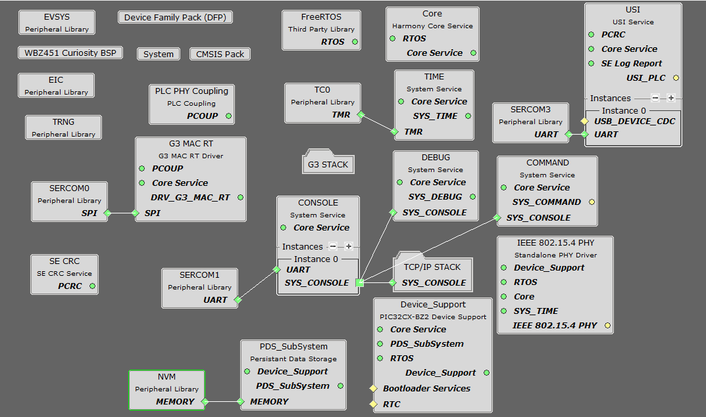
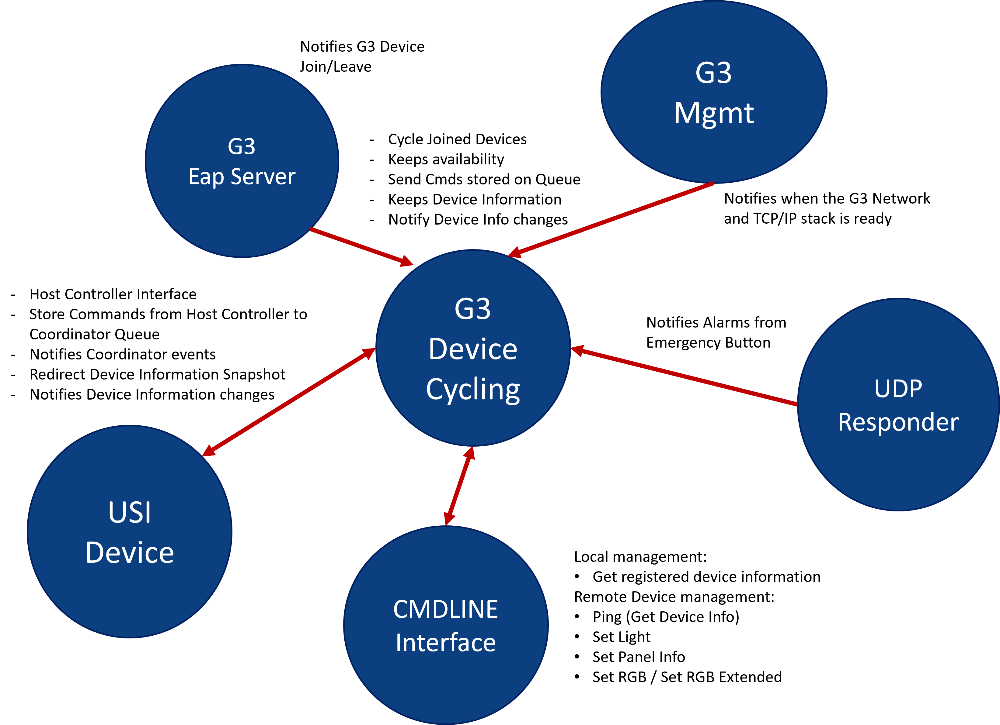
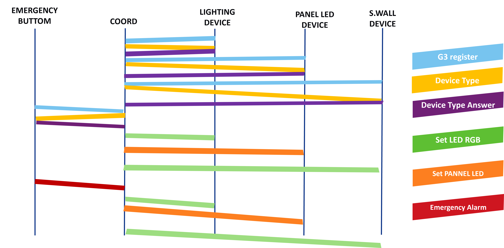

# G3 HYBRID COORDINATOR <!-- omit in toc -->

> "IoT Made Easy!" - This is an application using the unified G3-Hybrid PLC+RF protocol.

Devices: **| PIC32CX-BZ |** 
Features: **| G3 Hybrid protocol |**

## ⚠ Disclaimer <!-- omit in toc -->

<b>
THE SOFTWARE ARE PROVIDED "AS IS" AND GIVE A PATH FOR SELF-SUPPORT AND SELF-MAINTENANCE. This repository contains example code intended to help accelerate client product development.  

For additional Microchip repos, see: <a href="https://github.com/Microchip-MPLAB-Harmony" target="_blank">https://github.com/Microchip-MPLAB-Harmony</a>

Checkout the <a href="https://microchipsupport.force.com/s/" target="_blank">Technical support portal</a> to access our knowledge base, community forums or submit support ticket requests.

</b>

## Contents 

- [Introduction](#introduction)
- [Bill of Material](#bill-of-material)
- [Hardware Setup](#hardware-setup)
- [Software Setup](#software-setup)
  - [Development Tools](#development-tools)
  - [MCC Content Libraries](#mcc-content-libraries)
  - [Harmony MCC Configuration](#mcc-configuration)
  - [Application](#application)
- [Board Programming](#board-programming)
- [Run the demo](#run-demo)
- [Links](#links)

## Introduction

According with G3 technologies[*](#links) each G3 network requires the existence of a G3 Coordinator. G3 Hybrid coordinator runs on a WBZ451 Curiosity Board connected with a PL460-EK using an adaptation board   

## Bill of Material

| TOOLS | QUANTITY |
| :- | :- |
| [PIC32CX-BZ2 and WBZ451 Curiosity Development Board](https://www.microchip.com/en-us/development-tool/EV96B94A) | 1 |
| [PL460 Evaluation Kit](https://www.microchip.com/en-us/development-tool/ev13l63a) | 1 |
| [MikroBUS to PL460-EK adaptation board](docs/WBZ451mikroBUStoPL460EKadapter.png) | 1 |

## Software Setup
## Development Tools
  - MPLAB X v6.20
  - MPLAB® XC32 C/C++ Compiler v4.60
  - MPLAB® X IDE plug-ins: MPLAB® Code Configurator (MCC) v5.7.1 and above
  - Device Pack: PIC32CX-BZ2-DFP (1.4.243) , PIC32CX-BZ3-DFP (1.1.171),PIC32CX-BZ6-DFP(1.2.17)
	
## MCC Content Libraries

| Harmony MCC dependencies | version |
| :- | :- |
| bsp | v3.22.0 |
| csp | v3.22.0 |
| core | v3.15.0 |
| CMSIS_5 | v5.9.0 |
| wireless_pic32cxbz_wbz | v1.6.0 |
| wolfssl | v5.4.0 |
| crypto | v3.8.1 |
| wireless_phy | v1.4.0 |
| wireless_mac | v1.2.0 |
| CMSIS-FreeRTOS | v10.4.6 |

## Harmony MCC Configuration

The full MCC configuration is:

[TOP](#contents)

## Application

<b>The main functionalities of the G3 Coordinator are:</b>
* Register G3 devices in the G3 Network and assign a short address and MAC layer encryption key
* Pinging G3 devices in a loop way to keep the information about their availability
* Send commands to act/get information to/from G3 devices according with their functionality
* Notify alarms from Emergency Buttom

### G3 Hybrid devices

The G3 devices able to connect into the G3 coordinator and their functionalties are:

| NAME | DEVICE_TYPE | DEMO | FEATURE |
| :- | :- | :- | :- |
|Indoor Lighting|0x10|Smart Lighting Demo|Controls the indoor light state|
|Outdoor Lighting|0x11|Smart Lighting Demo|Controls the outdoor light state|
|Liquid Detector|0x13|Sustainability Wall Demo|Keep availability|
|Solar Inverter|0x14|Sustainability Wall Demo|Keep availability|
|Battery Charger|0x15|Sustainability Wall Demo|Keep availability|
|Energy Storage|0x16|Sustainability Wall Demo|Keep availability|
|Heat Pump|0x17|Sustainability Wall Demo|Keep availability|
|EV Charger|0x18|Sustainability Wall Demo|Keep availability|
|Electricity Meter|0x19|Sustainability Wall Demo|Keep availability|
|Emergency Button|0x1A|Hybrid IoT BP|Generate Alarms|
|LED Panel|0x1B|Hybrid IoT BP|Controls LED Panel state|

### G3 Hybrid coordinator specific configuration  

The G3 Hybrid coordinator has been configured fixing some parameters:
- Short Address: assigned short address is fixed according with the device type functionality of the G3 device
- PAN_ID: PAN ID identifies the G3 network in use. It is masked to be on 0x782X range. 
- PSK: Pre-shared Key used on the registering process. Avoids to register any unexpected G3 device. A fixed value different from default used on G3 certification has been configured.
- ADP PIBs: These ADP Pibs have been set according with the network: MaxHops, RrepWait and NetTraversalTime.
- RF Duty Cycle: the limit has been fixed to 100% removing any transmission restriction

### G3 Hybrid coordinator applications  

The G3 coordinator is based on different application files:
- app_g3_management: keeps the G3 coordinator feature running. 
- app_tcpip_management: keeps the TCP/IP stack available to be able to interact with the network at UDP layer and also keep the UDP responder server where the alarms are received.
- app_eap_server: provides the G3 coordinator registering and short address asignation feature.
- app_udp_responder: provides a UDP server where receive any notification from devices like alarms.
- app_cycling: provides the mechanism to transmit/receive information to/from the devices registered in the network; additionally implements a pinging cycling procedure to keep their availability. Besides, includes a queue for sending any additional command to the devices with the highest priority.
- app_interface: implements a command line mechanism to interface with the G3 network (through the queue implemented in the app_cycling) and manage local information and features (like registered devices information)
- app_usi_device: implements a mechanisms to serialize the command/notifications interchange between the G3 coordinator an the Host Controller based on PIC32CZCA80.

### Communication Protocol

The communication protocol starts with the G3 registering process interchange. After the device has joined the G3 network, the device is included into the pool of devices to ping in a cycling way (each minute in a normal situation) to keep their availability. The ping mechanism is based on the request of the device type and the answer from the device. When a device is alive, any additional command to interact with it can be sent.

### G3 Device Commands Interchange

| ID | NAME | SOURCE | DESTINATION | FEATURE |
| :- | :- | :- | :- | :- |
|0xF4|GET_DEVICE_INFO|COORD|ANY DEVICE|Get the Device Type Information|
|0xF5|GET_DEVICE_INFO_ANSWER|DEVICE|COORD|Provides the Device Type Information|
|0xF6|SET_RGB_LED|COORD|ANY DEVICE|Set the RGB LED colour|
|0xF8|SET_RGB_LED_BLINK|ANY DEVICE|Set the RGB LED colour with a frequency during a time|
|0xFA|SET_PANEL_INFO|COORD|PANEL LED|Set the information shown in the Panel LED|
|0xFC|EMERGENCY|EMERGENCY BUTTON|COORD|Emergency alarm after pressing the Emergency Button|
|0xFE|SET_LIGHT|COORD|LIGHTING DEVICE|Set the light state of a Lighting Device|

### G3 Cycling State Machine

The state machine of the G3 Coordinator cycling can be summarize on:

### G3 Command Line Interface

The project includes a CLI with these commands:

| COMMAND | PARAMS | Description |
| :- | :- | :- | 
|SET_LIGHT|<X(dest)> <0-1>|Set light 0:off, 1:on|
|SET_PANEL_INFO|<X(dest)> <0-1>|Set Panel Led (0:Logo, 1:Alarm)|
|SET_RGB|<X(dest)> <X(H)> <X(S)> <X(V)>|Set RGB Led colour - HSV Format|
|SET_RGBB|<X(dest)> <X(H)> <X(S)> <X(V)> <X(freq)> <X(time)>|Set RGB Led Colour, Blink and Duration|
|PING|<X(dest)>| Ping device X|
|REGDEV|None|Show G3 registered devices|
|DBGLVL|<0-4>|Debug Level <Fatal,Error,Warning,Info,Debug>|
|RST|None|Resets the board|

where:
| Device | X(dest)
| :- | :- |
|Indoor Lighting|0|
|Outdoor Lighting|1|
|Liquid Detector|3|
|Solar Inverter|4|
|Battery Charger|5|
|Energy Storage|6|
|Heat Pump|7|
|EV Charger|8|
|Electricity Meter|9|
|Emergency Button|10|
|LED Panel|11|

| Color | X(H)
| :- | :- |
|Red|00|
|Yellow|2B|
|Green|55|
|Cyan|80|
|Blue|AA|
|Magenta|D5|

## Board Programming

Programming the application can be done using MPLAB X IDE
- Open the given project using MPLAB X IDE
- Select the connected hardware tool in the project properties
- Make and program device

## Links

More Information about G3 can be found on:
- [G3 Alliance](https://g3-alliance.com/)
- [G3 Technologies](https://g3-alliance.com/technologies/)

More information about devices and hardware can be found on:
- [PL460 Datasheet](https://ww1.microchip.com/downloads/aemDocuments/documents/SE/ProductDocuments/DataSheets/PL460-Data-Sheet-DS60001666.pdf)
- [PL460 EK](https://www.microchip.com/en-us/development-tool/ev13l63a)
- [PL460-EK User Guide](https://ww1.microchip.com/downloads/aemDocuments/documents/MPU32/ProductDocuments/UserGuides/PL460-EK-User-Guide-DS50003322.pdf)
- [WBZ451 Datasheet](https://ww1.microchip.com/downloads/aemDocuments/documents/WSG/ProductDocuments/DataSheets/PIC32CX-BZ2-and-WBZ45-Family-Data-Sheet-DS70005504.pdf)
- [WBZ451 Curiosity Board](https://www.microchip.com/en-us/development-tool/ev96b94a)
- [WBZ451 Curiosity Board User Guide](https://ww1.microchip.com/downloads/aemDocuments/documents/WSG/ProductDocuments/UserGuides/WBZ451-Curiosity-Board-User-Guide-DS50003367.pdf)

More information about the Sustainability Wall reference designs configured as G3 devices can be found on:

- [Liquid Detection Reference Design](https://www.microchip.com/en-us/development-tool/EV24U22A)
- [Solar Microinverter Reference Design](https://www.microchip.com/en-us/tools-resources/reference-designs/grid-connected-solar-microinverter)
- [Solar MPPT Battery charger Reference Design](https://www.microchip.com/en-us/tools-resources/reference-designs/solar-mppt-battery-charger-reference-design)
- [Energy Storage Reference Design](https://www.microchip.com/en-us/tools-resources/reference-designs/high-voltage-auxiliary-e-fuse-reference-design)
- [Heat Pump Reference Design](https://www.microchip.com/en-us/tools-resources/reference-designs/11-kw-totem-pole-demonstration-application)
- [EV Charger Reference Design](https://www.microchip.com/en-us/tools-resources/reference-designs/three-phase-ac-commercial-with-ocpp-and-display-electric-vehicle-charger-reference-design)
- [Electricity Meter Reference Design](https://www.microchip.com/en-us/development-tool/EV58E84A)

