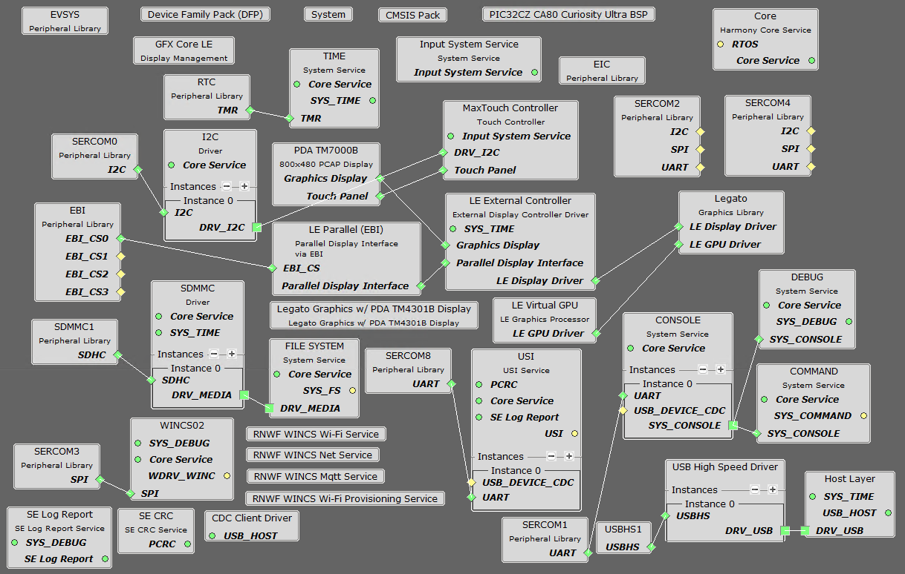

# G3_HYBRID_IOT_DEMO - G3 Devices <!-- omit in toc -->

> "IoT Made Easy!" - This is an application using the unified G3-Hybrid PLC+RF protocol.

Devices: **| PIC32CZ-CA80 |** 
Features: **| LCD Display, USI, Wi-Fi, LTE |**

## ⚠ Disclaimer <!-- omit in toc -->

<b>
THE SOFTWARE ARE PROVIDED "AS IS" AND GIVE A PATH FOR SELF-SUPPORT AND SELF-MAINTENANCE. This repository contains example code intended to help accelerate client product development.  

For additional Microchip repos, see: <a href="https://github.com/Microchip-MPLAB-Harmony" target="_blank">https://github.com/Microchip-MPLAB-Harmony</a>

Checkout the <a href="https://microchipsupport.force.com/s/" target="_blank">Technical support portal</a> to access our knowledge base, community forums or submit support ticket requests.

</b>

## Contents <!-- omit in toc -->
- [Introduction](#introduction)
- [Bill of materials](#bill-of-materials)
- [Hardware Setup](#hardware-setup)
- [Software Setup](#software-setup)
    - [Development Tools](#development-tools)
    - [MCC Content Libraries](#mcc-content-libraries)
    - [Harmony MCC Configuration](#harmony-mcc-configuration)
    - [Application](#application)
- [Board Programming](#board-programming)
- [Run the demo](#run-the-demo)

## Introduction
To be filled

## Bill of materials

| TOOLS                                                                                                                                     | QUANTITY |
| :---------------------------------------------------------------------------------------------------------------------------------------- | :------- |
| [PIC32CX-BZ2 and WBZ451 Curiosity Development Board](https://www.microchip.com/en-us/development-tool/EV96B94A)                           | 1        |
| [PL460 Evaluation Kit](https://www.microchip.com/en-us/development-tool/ev13l63a)                                                         | 1        |
| [MikroBUS to PL460-EK adaptation board](docs/WBZ451mikroBUStoPL460EKadapter.png)                                                          | 1        |

[TOP](#contents)

## Hardware Setup
- Connect the power supply on J7
- Connect a USB cable on J7 for device programming and debugging with terminal program

[TOP](#contents)

## Software Setup
#### Development Tools
  - MPLAB® X IDE v6.20
  - MPLAB® X IDE plug-ins: MPLAB® Code Configurator (MCC) v5.7.1 and above
  - MPLAB® XC32 C/C++ Compiler v4.60
  - MPLAB® Harmony v3
  - Device Pack: PIC32CZ-CA80_DFP (1.4.158)

#### MCC Content Libraries
| Harmony V3 component | version |
| :------------------- | :------ |
| core                 | v3.15.3 |
| wireless_system_rnwf | v3.0.0  |
| wireless_wifi        | v3.12.0 |
| csp                  | v3.22.6 |
| filex                | v6.2.1  |
| CMSIS_5              | v5.9.1  |
| usb                  | v3.16.0 |
| littlefs             | v2.10.0 |
| gfx                  | v3.16.0 |
| smartenergy          | v1.4.0  |
| bsp                  | v3.22.0 |

#### Harmony MCC Configuration

[TOP](#contents)

## Board Programming
Programming the application can be done using MPLAB X IDE
- Open the given project using MPLAB X IDE
- Select the connected hardware tool in the project properties
- Make and program device

[TOP](#contents)

## Run the demo
<b>The main functionalities of the host controller are:</b>
- receive/request network data from the coordinator
- make network data visible on the LCD display
- control devices from LCD display
- make network data visible on IoT dashboard via Wi-Fi and/or LTE connection
- control devices from IoT dashboard via Wi-Fi and/or LTE connection
- printout debug data on UART interface

<b>Communication protocol between host and and coordinator</b>
| ID   | NAME                    | SOURCE | DESTINATION | FEATURE                                      |
| :--- | :---------------------- | :----- | :---------- | :------------------------------------------- |
| 0xE0 | CMD_GET_DEVICES         | HOST   | COORD       | Request Registered Devices to Coordinator    |
| 0xE1 | CMD_GET_DEVICES_ANSWER  | COORD  | HOST        | Answer to request                            |
| 0xE2 | CMD_DEVICE_NOTIFICATION | COORD  | HOST        | Change of device information                 |
| 0xE3 | CMD_RESET_NOTIFICATION  | COORD  | HOST        | Coordinator reset occured                    |
| 0xE4 | CMD_HEARTBEAT           | COORD  | HOST        | Coordinator heartbeat, received periodically |

<b>UART interface</b>  
For debugging purposes, a UART interface to the PC is implemented. A serial port terminal (e.g. PuTTY) can be used to open a connection to the device.  
  
USART configuration:
- Baud rate: 115 200 Hz
- Parity mode: no parity
- Stop bit mode: 1 Stop bit

[TOP](#contents)
