# G3_HYBRID_IOT_DEMO - G3 Devices <!-- omit in toc -->

> "IoT Made Easy!" - This is an application using the unified G3-Hybrid PLC+RF protocol.

Devices: **| PIC32CX-BZ | PL460 |** 
Features: **| G3 Hybrid protocol |**

## ⚠ Disclaimer 

<b>
THE SOFTWARE ARE PROVIDED "AS IS" AND GIVE A PATH FOR SELF-SUPPORT AND SELF-MAINTENANCE. This repository contains example code intended to help accelerate client product development.  

For additional Microchip repos, see: <a href="https://github.com/Microchip-MPLAB-Harmony" target="_blank">https://github.com/Microchip-MPLAB-Harmony</a>

Checkout the <a href="https://microchipsupport.force.com/s/" target="_blank">Technical support portal</a> to access our knowledge base, community forums or submit support ticket requests.

</b>

## Contents 
- [Introduction](#introduction)
- [Bill of materials](#bill-of-materials)
- [Hardware Setup](#hardware-setup)
- [Software Setup](#software-setup)
    - [Development Tools](#development-tools)
    - [MCC Content Libraries](#mcc-content-libraries)
    - [Harmony MCC Configuration](#harmony-mcc-configuration)
    - [Application](#application)
- [Board Programming](#board-programming)
- [Run the demo](#run-the-demo)

## Introduction

According with G3 technologies[*](#links) each G3 network requires the existence of a G3 Coordinator and G3 Devices. G3 Hybrid device runs on a WBZ451HPE Curiosity Board connected with a PL460-EK using an adaptation board.

[TOP](#contents)

## Bill of materials

| TOOLS                                                                                                                                     | QUANTITY |
| :---------------------------------------------------------------------------------------------------------------------------------------- | :------- |
| [PIC32CX-BZ2 and WBZ451HPE Curiosity Development Board](https://www.microchip.com/en-us/development-tool/ev79y91a)                           | 1        |
| [PL460 Evaluation Kit (rev4)](https://www.microchip.com/en-us/development-tool/ev13l63a)                                                         | 1        |
| [MikroBUS to PL460-EK adaptation board](docs/WBZ451mikroBUStoPL460EKadapter.png)                                                          | 1        |
| [Panel LED](https://www.adafruit.com/product/2278)                           | 1        |
| [PROTO1 XPLAINED PRO EXTENSION KIT](https://www.microchip.com/en-us/development-tool/atproto1-xpro)                           | 1        |

[TOP](#contents)

## Hardware Setup

- Proto1 Xplained Pro Extension Kit is used to interface WBZ451HPE XPRO2 connector to the [Panel LED interface](doc/PanelLED_pins.png). The configuration selected is:

| PIN | PINOUT | XPRO2 | PANEL_LED   |
|:----|:-------|:------|:------------|
| 1	  | ID	   | ID    |             |
| 2	  | GND	   | GND   |  PANEL_GND  |
| 3	  | ADC+   | PB6   | (PL460 CS)  |
| 4   |	ADC-	 | PB3   | (PL460 SCK) |
| 5   |	GPIO1	 | PA3   |(PL460 EXTIN)|
| 6   |	GPIO2	 | PA4   | (PL460 NRST)|
| 7   |	PWM+	 | PA1	 |  PANEL_OE   |
| 8   |	PWM-	 | PB0   |	PANEL_B1   |
| 9   |	IRQ	   | PA0   | (PL460 TXEN)|
| 10  |	GPIO	 | PB7   |  PANEL_B2   |
| 11  |	SDA	   | PA7	 |  PANEL_C    |
| 12  |	SCL	   | PA8	 |  PANEL_D    |
| 13  |	RXD	   | PA6   |  PANEL_B    |
| 14  |	TXD	   | PA5   |	PANEL_A    |
| 15  |	SS     | PB2	 |  PANEL_CLK  |
| 16  |	MOSI	 | PB12	 |  PANEL_R2   |
| 17  |	MISO	 | PB13	 |  PANEL_LAT  |
| 18  |	SCK	   | PB11	 |  PANEL_R1   |
| 19  |	GND	   | GND   |  PANEL_GND	 |
| 20  |	3V3	   | 3V3	 |             |

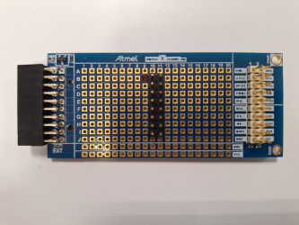

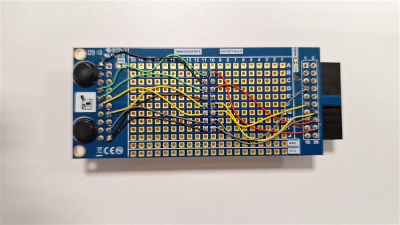

- The PL460-EK rev4 need to be modified with these changes:
  - Replace C9 by a 10K Pull Down resistor to GND (PL460_NRST)
  - Include 10K Pull Up resistor to 3V3 on PL460_ENABLE and cut the trace to XPLAINED PRO connector
  - Include 10K Pull Down resistor to GND on PL460_STBY and cut the trace to XPLAINED PRO connector
  - Cut the PL460_NTHW0 trace to XPLAINED PRO connector
  - Short between TX_ENABLE and NTHW0 pins on XPLAINED PRO connector

- The WBZ451HPE need to be modified with these changes:
  - Remove R169 -> disable USER_BUTTON
  - Remove R94 and R95 -> disable Blue and Green pins of RGB Led
  - Remove R1, R2, R3, R4 -> disable UART Virtual Comm Port
  - Remove R120 -> disable USER_LED
  - Remove R142 -> to use PA8

- Connect the Panel LED board adaptation to XPRO2 connector of WBZ451HPE and supply it with 5V
- Supply the Panel LED with a recommended +5V Power Supply
- Connect the PL460-EK to XPRO1 connector of WBZ451HPE and supply it with the provided +15V Power Supply
- Connect a +5V power supply on WBZ451HPE J7 USB-C Connector
- Connect a USB cable on J7 in case of device programming

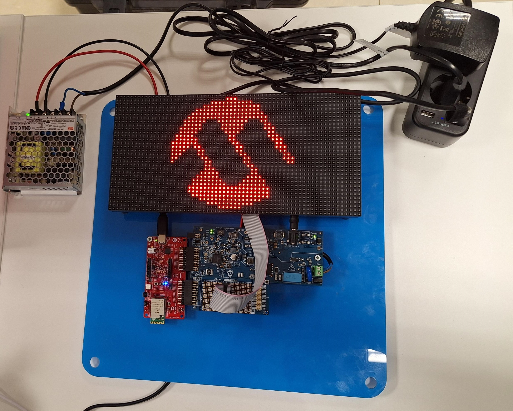

[TOP](#contents)

## Software Setup
### Development Tools
  - MPLAB® X IDE v6.25
  - MPLAB® X IDE plug-ins: MPLAB® Code Configurator (MCC) v5.7.1 and above
  - MPLAB® XC32 C/C++ Compiler v4.60
  - MPLAB® Harmony v3
  - Device Pack: PIC32CZ-CA80_DFP (1.4.243)

### MCC Content Libraries
| Harmony V3 component   | version   |
| :----------------------| :---------|
| core                   | v3.13.5   |
| wireless_pic32cxbz_wbz | v1.2.0    |
| wireless_15_4_phy      | v1.2.0    |
| csp                    | v3.19.1   |
| net                    | v3.12.0   |
| CMSIS_5                | v5.8.0    |
| CMSIS-FreeRTOS         | v10.5.1   |
| smartenergy            | v1.2.1    |
| smartenergy_g3         | v1.0.1    |
| bsp                    | v3.20.1   |
| wolfssl                | v5.6.7-E1 |
| crypto                 | v4.0.0-E1 |

### Harmony MCC Configuration

#### Full Configuration

The full MCC configuration is:
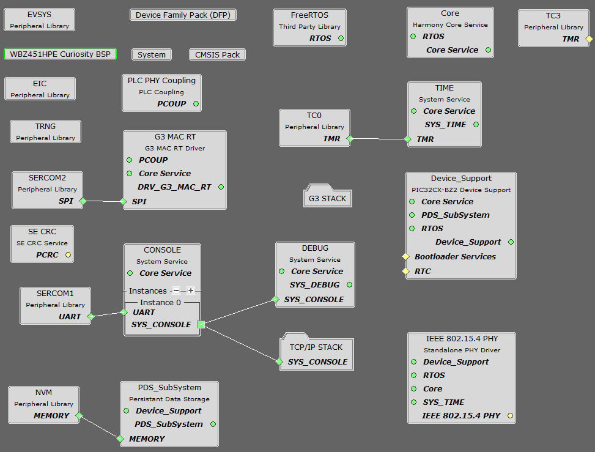

#### System Console and Debugging
The system console is configured to use SERCOM1 in USART mode and is accessible on TX-RX pins of MikroBUS connector.

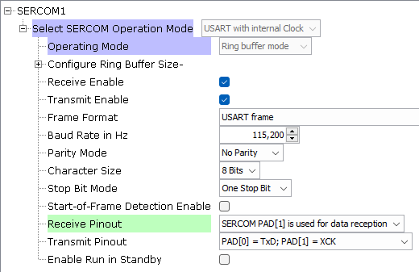
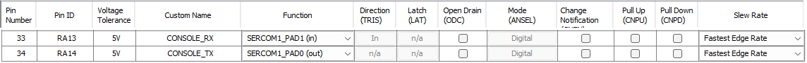
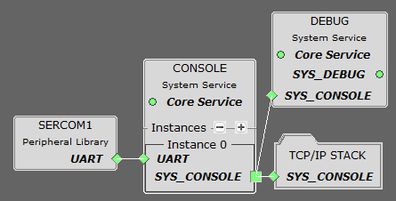

#### G3 and PL460-EK interface

The G3 device is configured to use SERCOM2 in SPI mode to access the PL460-EK.

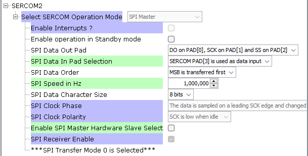

The project uses MAC real time features on FCC band with default values for PLC PHY coupling. 

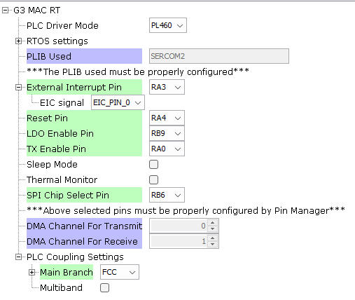

The PIN configuration for the PL460 interface is:

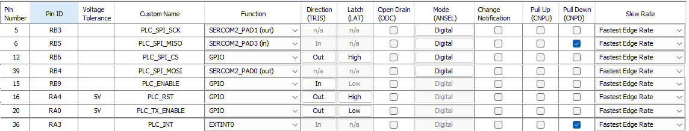

The G3 stack full configuration is:

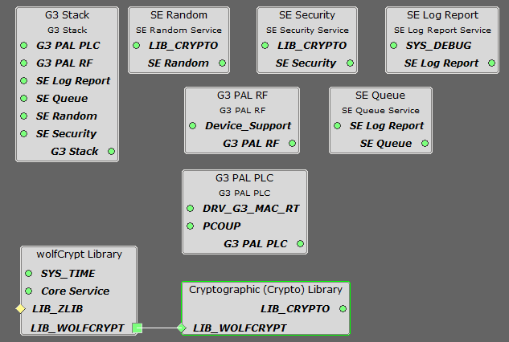

The G3 stack is configured in mode Hybrid PLC & RF with PAN Device as role.

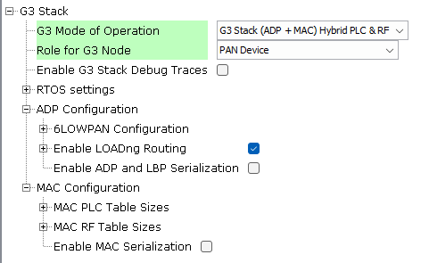

The Crypto configuration to accomplish with G3 Security features is:

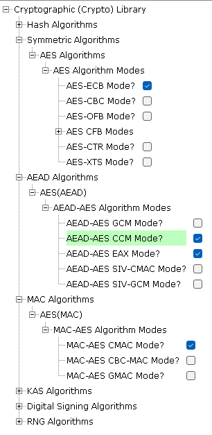

#### Panel Led Configuration
The application identify some events acting over a Panel Led. Panel LED pins are controlled with gpios:

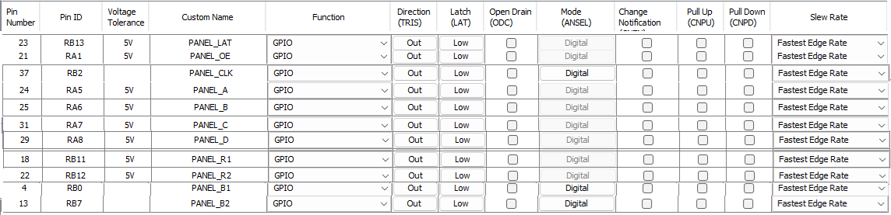

#### Watchdog Configuration
The Watchdog is enabled to avoid any unhandled situation on the application.

[TOP](#contents)

## Application

<b>The main functionalities of the G3 device are:</b>
* Register into G3 Network created by the G3 Coordinator
* Receive commands from G3 coordinator to act/get information to/from G3 device

### G3 Hybrid devices

The G3 devices able to connect into the G3 coordinator and their functionalties are:

| NAME            | DEVICE_TYPE | DEMO                   | FEATURE                        |
| :-              | :-          | :-                     | :-                             |
|Indoor Lighting  |0x10         |Smart Lighting Demo     |Controls the indoor light state |
|Outdoor Lighting |0x11         |Smart Lighting Demo     |Controls the outdoor light state|
|Liquid Detector  |0x13         |Sustainability Wall Demo|Monitors availability           |
|Solar Inverter   |0x14         |Sustainability Wall Demo|Monitors availability           |
|Battery Charger  |0x15         |Sustainability Wall Demo|Monitors availability           |
|Energy Storage   |0x16         |Sustainability Wall Demo|Monitors availability           |
|Heat Pump        |0x17         |Sustainability Wall Demo|Monitors availability           |
|EV Charger       |0x18         |Sustainability Wall Demo|Monitors availability           |
|Electricity Meter|0x19         |Sustainability Wall Demo|Monitors availability           |
|Emergency Button |0x1A         |Hybrid IoT BP           |Generate Alarms                 |
|LED Panel        |0x1B         |Hybrid IoT BP           |Controls LED Panel state        |

### G3 Hybrid device specific configuration  

The G3 Hybrid device has been configured fixing some parameters:

- <b>PAN_ID</b>: PAN ID identifies the G3 network in use. It is masked to be on 0x782X range. 
- <b>ADP PIBs</b>: These ADP Pibs have been set according with the network: MaxHops, RREQWait, RREPWait and NetTraversalTime.
- <b>RF Duty Cycle</b>: the limit has been fixed to 100% removing any transmission restriction

### G3 Hybrid device applications  

The G3 device is based on different application files:
- <b>app_g3_management</b>: keeps the G3 device feature running including registering. Additionally a protection mechanism to reset the device if not traffic is received for a while has been implemented too. 
- <b>app_tcpip_management</b>: keeps the TCP/IP stack available to be able to interact with the network at UDP layer and also keep the UDP responder server where the alarms are received.
- <b>app_udp_responder</b>: provides a UDP server where receive any command from coordinator.
- <b>app_matrix_led</b>: controls the information shown into the Panel LED.

### Communication Protocol

The communication protocol starts with the G3 device registering process interchange. After the device has joined the G3 network, the device is included into the pool of devices to be ping from the coordinator in a cycling way (each minute in a normal situation) to keep their availability. The ping mechanism is based on the request of the device type and the answer from the device. When a device is alive, any additional command to interact with it can be sent.

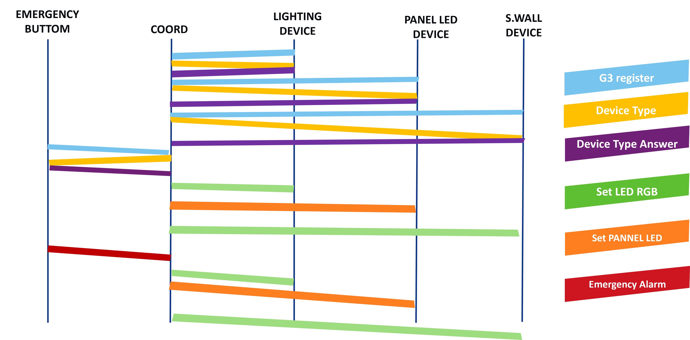

### G3 Device Commands Interchange

| ID | NAME                 | SOURCE         | DESTINATION   | FEATURE                                             |
| :- | :-                   | :-             | :-            | :-                                                  |
|0xF4|GET_DEVICE_INFO       |COORD           |ANY DEVICE     |Get the Device Type Information                      |
|0xF5|GET_DEVICE_INFO_ANSWER|DEVICE          |COORD          |Provides the Device Type Information                 |
|0xF6|SET_RGB_LED           |COORD           |ANY DEVICE     |Set the RGB LED colour                               |
|0xF8|SET_RGB_LED_BLINK     |COORD           |ANY DEVICE     |Set the RGB LED colour with a frequency during a time|
|0xFA|SET_PANEL_INFO        |COORD           |PANEL LED      |Set the information shown in the Panel LED           |
|0xFC|EMERGENCY             |EMERGENCY BUTTON|COORD          |Emergency alarm after pressing the Emergency Button  |
|0xFE|SET_LIGHT             |COORD           |LIGHTING DEVICE|Set the light state of a Lighting Device             |

[TOP](#contents)

## Board Programming
Programming the application can be done using MPLAB X IDE
- Open the given project using MPLAB X IDE
- Select the connected hardware tool in the project properties
- Make and program device

[TOP](#contents)

## Run the demo

After powering up the WBZ451HPE (5V Power Supply), PL460 (15V Power Supply) and Panel LED (5V Power Supply), the Panel LED shows the Microchip Logo and the G3 device starts trying to join a G3 Network.

Each time the device is pinged from the LCD Touch Screen or the Cloud, the Panel Led shows the Microchip Logo.
Each time there is an alarm (pressing the Emergency Button) the device is notified from the system and the Panel Led shows the Alarm Logo for a while.

<b>UART interface</b>  
For debugging purposes, a UART interface to the PC is implemented. A serial port terminal (e.g. PuTTY) can be used to open a connection to the device.  
  
USART configuration:
- Baud rate: 115 200 Hz
- Parity mode: no parity
- Stop bit mode: 1 Stop bit

[TOP](#contents)

## Links

More Information about G3 can be found on:
- [G3 Alliance](https://g3-alliance.com/)
- [G3 Technologies](https://g3-alliance.com/technologies/)

More information about devices and hardware can be found on:
- [PL460 Datasheet](https://ww1.microchip.com/downloads/aemDocuments/documents/SE/ProductDocuments/DataSheets/PL460-Data-Sheet-DS60001666.pdf)
- [PL460 EK](https://www.microchip.com/en-us/development-tool/ev13l63a)
- [PL460-EK User Guide](https://ww1.microchip.com/downloads/aemDocuments/documents/MPU32/ProductDocuments/UserGuides/PL460-EK-User-Guide-DS50003322.pdf)
- [WBZ451 Datasheet](https://ww1.microchip.com/downloads/aemDocuments/documents/WSG/ProductDocuments/DataSheets/PIC32CX-BZ2-and-WBZ45-Family-Data-Sheet-DS70005504.pdf)
- [WBZ451 HPE Curiosity Board](https://www.microchip.com/en-us/development-tool/ev79y91a)
- [WBZ451 Curiosity Board User Guide](https://ww1.microchip.com/downloads/aemDocuments/documents/WSG/ProductDocuments/UserGuides/WBZ451HPE-Curiosity-Board-User-Guide-DS50003681.pdf)

More information about the Sustainability Wall reference designs configured as G3 devices can be found on:

- [Liquid Detection Reference Design](https://www.microchip.com/en-us/development-tool/EV24U22A)
- [Solar Microinverter Reference Design](https://www.microchip.com/en-us/tools-resources/reference-designs/grid-connected-solar-microinverter)
- [Solar MPPT Battery charger Reference Design](https://www.microchip.com/en-us/tools-resources/reference-designs/solar-mppt-battery-charger-reference-design)
- [Energy Storage Reference Design](https://www.microchip.com/en-us/tools-resources/reference-designs/high-voltage-auxiliary-e-fuse-reference-design)
- [Heat Pump Reference Design](https://www.microchip.com/en-us/tools-resources/reference-designs/11-kw-totem-pole-demonstration-application)
- [EV Charger Reference Design](https://www.microchip.com/en-us/tools-resources/reference-designs/three-phase-ac-commercial-with-ocpp-and-display-electric-vehicle-charger-reference-design)
- [Electricity Meter Reference Design](https://www.microchip.com/en-us/development-tool/EV58E84A)

[TOP](#contents)

