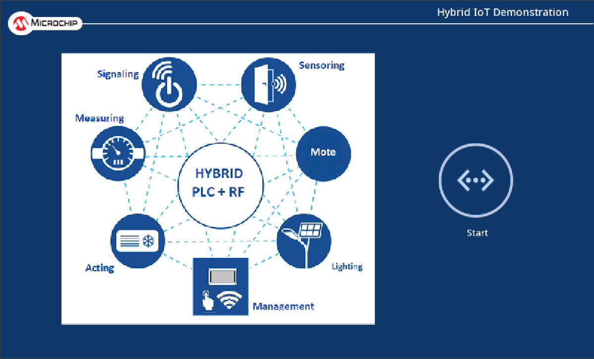
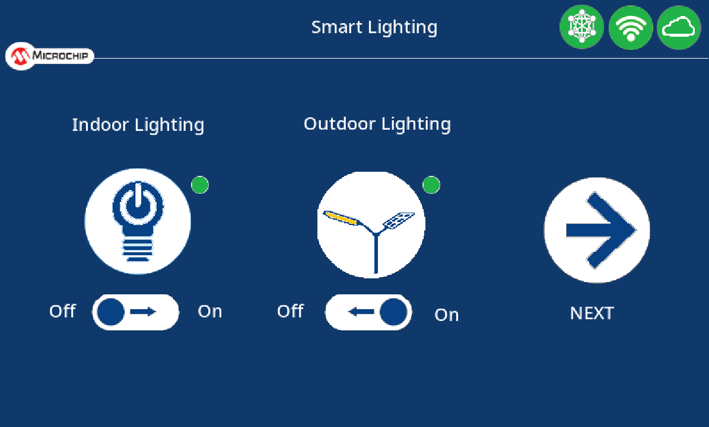

# G3_HYBRID_IOT_DEMO - Host Controller <!-- omit in toc -->

> "IoT Made Easy!" - This is an application using the unified G3-Hybrid PLC+RF protocol.

Devices: **| PIC32CZ-CA80 |** 
Features: **| LCD Display, USI, Wi-Fi, LTE |**

## ⚠ Disclaimer <!-- omit in toc -->

<b>
THE SOFTWARE ARE PROVIDED "AS IS" AND GIVE A PATH FOR SELF-SUPPORT AND SELF-MAINTENANCE. This repository contains example code intended to help accelerate client product development.  

For additional Microchip repos, see: <a href="https://github.com/Microchip-MPLAB-Harmony" target="_blank">https://github.com/Microchip-MPLAB-Harmony</a>

Checkout the <a href="https://microchipsupport.force.com/s/" target="_blank">Technical support portal</a> to access our knowledge base, community forums or submit support ticket requests.

</b>

## Contents <!-- omit in toc -->
- [Introduction](#introduction)
- [Bill of materials](#bill-of-materials)
- [Hardware Setup](#hardware-setup)
- [Software Setup](#software-setup)
    - [Development Tools](#development-tools)
    - [MCC Content Libraries](#mcc-content-libraries)
    - [Harmony MCC Configuration](#harmony-mcc-configuration)
- [Application](#application)
  - [Communication Protocol between Host and G3 coordinator](#communication-protocol-between-host-and-g3-coordinator)
  - [Cloud Connection](#cloud-connection)
- [Board Programming](#board-programming)
- [Run the demo](#run-the-demo)

## Introduction
PIC32CZCA80 host controller receives network data from the coordinator via USI interface and makes it visible on the LCD display and IoT dashboards via Wi-Fi and/or LTE connection.

## Bill of materials
| TOOLS                                                                                                                                     | QUANTITY |
| :---------------------------------------------------------------------------------------------------------------------------------------- | :------- |
| [PIC32CZ CA80 Curiosity Ultra Development Board](https://www.microchip.com/en-us/development-tool/ev51s73a)                               | 1        |
| [LCD Display](https://www.digikey.de/en/products/detail/precision-design-associates-inc/TM7000B/5799782)                                  | 1        |
| [WINCS02 Add-on Board](https://www.microchip.com/en-us/development-tool/ev68g27a)                                                         | 1        |
| [MIKROBUS XPLAINED PRO](https://www.microchip.com/en-us/development-tool/atmbusadapter-xpro)                                              | 1        |
| [LTE IoT 10 Click](https://www.mikroe.com/lte-iot-10-click)              | 1        |
| [1x8 Stacking Header (2pcs)](https://www.mikroe.com/1x8-stacking-header?srsltid=AfmBOooIEhpG3wF2mNdx-oSNY7o1VDku00dP_zKG2-vrS92IRNznL81C) | 2        |

[TOP](#contents)

## Hardware Setup
- Connect the power supply on J100
- Connect Debug USB (J200) to PC
- Connect USI interface to coordinator
  - Connect PD24 and PD25 available on J401 to PB13 and PB12 (available on test point array J9 Pin 7 and 6) on WBZ451
- Connect the SSD1963 LCD Controller Card to the Graphics Connector
- Connect the WVGA LCD Display to the SSD1963 LCD Controller Card
- Connect the WINCS02 Add-on Board on microBUS header using the stacking header
  - connect mikroBus pins: 2-10, 15
- Connect the MIKROBUS XPLAINED PRO on EXT2 header
  - connect +5V and +3.3V at External Power Header of mikroBUS Xplained Pro, remove voltage selection jumper
- Connect the LTE IoT 10 Click on microBus of the MIKROBUS XPLAINED PRO using the stacking header
  - connect mikroBus pins: 1, 2, 7, 8, 9, 10, 13, 14
- Connect PKoB USB to PC for device programming and debugging with terminal program

[TOP](#contents)

## Software Setup
#### Development Tools
  - MPLAB® X IDE v6.20
  - MPLAB® X IDE plug-ins: MPLAB® Code Configurator (MCC) v5.7.1 and above
  - MPLAB® XC32 C/C++ Compiler v4.60
  - MPLAB® Harmony v3
  - Device Pack: PIC32CZ-CA80_DFP (1.4.158)

#### MCC Content Libraries
| Harmony V3 component | version |
| :------------------- | :------ |
| core                 | v3.15.3 |
| wireless_system_rnwf | v3.0.0  |
| wireless_wifi        | v3.12.0 |
| csp                  | v3.22.6 |
| filex                | v6.2.1  |
| CMSIS_5              | v5.9.1  |
| usb                  | v3.16.0 |
| littlefs             | v2.10.0 |
| gfx                  | v3.16.0 |
| smartenergy          | v1.4.0  |
| bsp                  | v3.22.0 |

#### Harmony MCC Configuration

## Application

<b>The main functionalities of the host controller are:</b>
- receive/request G3 network data from the G3 Coordinator
- make G3 network data visible on the touch screen
- control G3 devices from touch screen
- make connection with the Cloud through Wi-Fi or LTE on the touch screen
- make G3 network data visible on IoT dashboard via Wi-Fi and/or LTE connection
- control G3 devices from IoT dashboard via Wi-Fi and/or LTE connection
- make G3 network data visible on the command line interface
- control G3 coordinator and devices from the command line interface
- printout debug data on UART interface

### G3 Hybrid devices

The G3 devices connected into the G3 coordinator managed by the host controller and their functionalties are:

| NAME | DEVICE_TYPE | DEMO | FEATURE |
| :- | :- | :- | :- |
|Indoor Lighting|0x10|Smart Lighting Demo|Controls the indoor light state|
|Outdoor Lighting|0x11|Smart Lighting Demo|Controls the outdoor light state|
|LED Panel|0x12|Hybrid IoT BP|Controls LED Panel state|
|Liquid Detector|0x13|Sustainability Wall Demo|Keep availability|
|Solar Inverter|0x14|Sustainability Wall Demo|Keep availability|
|Battery Charger|0x15|Sustainability Wall Demo|Keep availability|
|Energy Storage|0x16|Sustainability Wall Demo|Keep availability|
|Heat Pump|0x17|Sustainability Wall Demo|Keep availability|
|EV Charger|0x18|Sustainability Wall Demo|Keep availability|
|Electricity Meter|0x19|Sustainability Wall Demo|Keep availability|
|Emergency Button|0x1A|Hybrid IoT BP|Generate Alarms|

### Host Controller applications

The Host Controller is based on different application files:
- app_coordinator: implements the features related with the interaction and information management of G3 Network through a USI serialization with the G3 Coordinator.
- app_wifi: implements the features related with the connection to Internet and the Cloud throught a WiFi network using the Microchip WINCS02 device. 
- app_lte: implements the features related with the connection to Internet and the Cloud throught a WiFi network using a LTE-M/NB-IoT module from Sequans.
- app_ui: implements the interface between the differents applications and the applications related with the graphics. The communication is bases on registering notifications and a messages queue.
- app_screen_main: implements the features related with the OnShow, OnHide and OnUpdate events on the touch screen related with the main screen
- app_screen_swall: implements the features related with the OnShow, OnHide and OnUpdate events on the touch screen related with devices taking part of the Sustainability Wall Demo
- app_screen_lighting: implements the features related with the OnShow, OnHide and OnUpdate events on the touch screen related with devices taking part of the Smart Lighting Demo
- app_interface: implements a command line mechanism to interface with the G3 coordinator and the G3 network (through a queue implemented in the app_coordinator) and manage local information and features (like registered devices information)

### Communication Protocol between Host and G3 coordinator

The communication protocol between host and G3 coodinator runs over the USI Service serialization from <a href="https://github.com/Microchip-MPLAB-Harmony/smartenergy" target="_blank">Microhip MPLAB Harmony smartenergy repository</a>.

The communication starts with the notification from the G3 Coordinator of a reset (in a typical situation) or a heartbeat (if unmanaged reset happens on the host). After that event, the host will start requesting the full device information in a cycling way (each minute in a normal situation) to keep their availability. The ping mechanism is based on the request of the device type and the answer from the device. When a device is alive, any additional command to interact with it can be sent.

The ping mechanism is based on the request of the device type and the answer from the device. When a device is alive, any additional command to interact with it can be sent.

The communication protocol commands implemented are based on the G3 coordinator commands to interact with G3 devices on the network and additional commands to handle/notify information/events available on G3 Coordinator.

| ID   | NAME                    | SOURCE | DESTINATION | FEATURE                                      |
| :--- | :---------------------- | :----- | :---------- | :------------------------------------------- |
| 0xF4 | GET_DEVICE_INFO         | HOST   | COORD       | Get the Device Type Information              |
| 0xF6 | SET_RGB_LED             | HOST   | COORD       | Set the RGB LED colour                       |
| 0xF8 | SET_RGB_LED_BLINK       | HOST   | COORD       | As previous blinking with a freq a while     |
| 0xFA | SET_PANEL_INFO          | HOST   | COORD       | Set the information shown in the Panel LED   |
| 0xFC | EMERGENCY               | COORD  | HOST        | Emergency Alarm received                     |
| 0xFE | SET_LIGHT               | HOST   | COORD       | Set the light state of a Lighting Device     |
| 0xE0 | CMD_GET_DEVICES         | HOST   | COORD       | Request Registered Devices to Coordinator    |
| 0xE1 | CMD_GET_DEVICES_ANSWER  | COORD  | HOST        | Answer to request                            |
| 0xE2 | CMD_DEVICE_NOTIFICATION | COORD  | HOST        | Change of device information                 |
| 0xE3 | CMD_RESET_NOTIFICATION  | COORD  | HOST        | Coordinator reset occured                    |
| 0xE4 | CMD_HEARTBEAT           | COORD  | HOST        | Coordinator heartbeat, received periodically |

### Command Line Interface

The project includes a CLI with these commands:

| COMMAND | PARAMS | Description |
| :- | :- | :- | 
|SET_LIGHT|<X(dest)> <0-1>|Set light 0:off, 1:on|
|SET_PANEL_INFO|<X(dest)> <0-1>|Set Panel Led (0:Logo, 1:Alarm)|
|SET_RGB|<X(dest)> <X(H)> <X(S)> <X(V)>|Set RGB Led colour - HSV Format|
|SET_RGBB|<X(dest)> <X(H)> <X(S)> <X(V)> <X(freq)> <X(time)>|Set RGB Led Colour, Blink and Duration|
|PING|<X(dest)>| Ping device X|
|REGDEV|None|Show registered G3 devices|
|DBGLVL|<0-4>|Debug Level <Fatal,Error,Warning,Info,Debug>|
|CRST|None|Resets the G3 Coordinator|
|POWER|<0-1>| Coordinator Power 0:off, 1:on |
|SET_WIFI|<SSID> <PASS> <SEC>| Sets WiFi Parameters ssid, pass and security (0-5)|
|GET_WIFI|None| Gets WiFi Parameters ssid, pass and security|

### LCD Graphics Interface
The graphic interface is based on these elements:

#### System Status Icons

The system status is shown the upper-right part of the screen. It is based on 4 icons related with:
- Alarm Status: appears when a alarm occurs

- G3 Coordinator Status: on "red" or "green" depending on if G3 coordinator is ready or not

- Wifi Connection Status: on "red" if WINCS02 is not ready, "yellow" when looking for a WiFi network or "green" when connected.

- Cloud Connection Status: on "red" while the WiFi is not ready, switching to "yellow" when WiFi is ready and the application is trying to connect to the Cloud and "green" when connected.

#### Main Screen
On start-up the main screen is shown. Press Start Button to pass to the next screen.

#### Sustainability Wall Screen
The Sustainability Wall Screen allows to interact with devices on the Sustainability Wall Demo. 

For each device, the small circle colour represents the availability:

- Red: device disconnected
- Yellow: device joined but still not received the device type
- Green: device available

Pressing the device picture button, the system sends a command to the corresponding device (if available) to set the RGB LED on cyan and blinking during 10 seconds.

#### Smart Lighting Screen
The Smart Lighting Screen allows to interact with devices on the Smart Lighting Demo:

- Indoor Lighting
- Outdoor Lighting

Pressing the device picture button, the system sends a command to the corresponding device to set the RGB LED on cyan and blinking during 10 seconds.

Pressing the on-off switch, the system sends a command to the corresponding device to switch on-off the light.

Pressing th "Next" button, the screen is replaced by the next screen.

### Cloud Connection
The MQTT broker used for this demo is KaaIoT, and the corresponding dashboard is shown below:

All the MQTT connection parameters (including the broker URL, authentication credentials and topics for subscription and publication) are configured in [configuration.h](./firmware/src/config/lcc_rgb565_mxt_cz_ca80_cu/configuration.h#L92).

#### Wi-Fi Connection

Wi-Fi connection is established using the WINCS02 Add On Board. After powering up the host, the device initializes automatically, establishes a Wi-Fi connection and connects to the MQTT broker. By subscribing to relevant topics, the device can receive data from the broker, while publishing topics allows it to send data.  

To change Wi-Fi credentials there are different ways:
- Change hard coded default credentials in [configuration.h](./firmware/src/config/lcc_rgb565_mxt_cz_ca80_cu/configuration.h#L320)
- Use Wi-Fi provisioning (started automatically in case connection with default credentials can`t be established)
  - connect to SSID 'AP_HYBRID_IOT' and password 'microchip' via mobile phone
  - use App 'Wi-Fi Provisioning' from Microchip
  - enter Server IP Address: 192.168.1.1, Port: 80 -> connect
  - choose WiFi network, enter password and send
- use microSD card containing a file called wifiCfg.txt with content "ssid=XXX,key=XXX,sec=X"
  
In case microSD card is plugged, the credentials given on Wi-Fi provisioning are also stored on microSD card and are used on next reset.

#### LTE Connection

LTE connection is established using the LTE IoT 10 Click board. After powering up the host, the device initializes automatically, registers on the network and connects to the MQTT broker. By subscribing to relevant topics, the device can receive data from the broker, while publishing topics allows it to send data.

[TOP](#contents)

## Board Programming
Programming the application can be done using MPLAB X IDE
- Open the given project using MPLAB X IDE
- Select the connected hardware tool in the project properties
- Make and program device

[TOP](#contents)

## Run the demo
<b>UART interface</b>  
For debugging purposes and access to the command line, a UART interface to the PC is implemented. A serial port terminal (e.g. PuTTY) can be used to open a connection to the device.  
  
USART configuration:
- Baud rate: 115 200 Hz
- Parity mode: no parity
- Stop bit mode: 1 Stop bit

## Links

More information about the Hardware can be found on:
- [PIC32CZ CA80 Datasheet](https://ww1.microchip.com/downloads/aemDocuments/documents/MCU32/ProductDocuments/DataSheets/PIC32CZ-CA80-CA90-Family-Data-Sheet-DS60001749.pdf)
- [PIC32CZ CA80 Curiosity Ultra Development Board](https://www.microchip.com/en-us/development-tool/ev51s73a)
- [PIC32CZ CA80 Curiosity Ultra Development Board User Guide](https://ww1.microchip.com/downloads/aemDocuments/documents/MCU32/ProductDocuments/UserGuides/PIC32CZ-CA80-CA90-Curiosity-Ultra-User-Guide-DS70005522.pdf)
- [WINCS02 WiFi Module Datasheet](https://ww1.microchip.com/downloads/aemDocuments/documents/WSG/ProductDocuments/DataSheets/WINCS02-Wi-Fi-Module-Data-Sheet-DS70005577.pdf)
- [WINCS02 Add-on Board](https://www.microchip.com/en-us/development-tool/ev68g27a)
- [WINCS02 Add-on Board User Guide](https://ww1.microchip.com/downloads/aemDocuments/documents/WSG/ProductDocuments/UserGuides/WINCS02-Add-On-Board-Users-Guide-DS50003721.pdf)
- [LTE IoT 10 Click](https://www.mikroe.com/lte-iot-10-click)
- [WVGA LCD Display with MaxTouch](https://www.microchip.com/en-us/development-tool/ac320005-5)
- [WVGA LCD Display with MaxTouch User Guide](https://ww1.microchip.com/downloads/aemDocuments/documents/OTH/ProductDocuments/Brochures/50002681B.pdf)
- [SSD1963 LCD Controller Graphics Card](https://www.microchip.com/en-us/development-tool/ac320214)
- [SSD1963 LCD Controller Graphics Card Information](https://ww1.microchip.com/downloads/en/DeviceDoc/SSD1963_LCD_Controller_%20Graphics_Card_DS50002915A.pdf)

More information about the Sustainability Wall reference designs configured as G3 devices can be found on:

- [Liquid Detection Reference Design](https://www.microchip.com/en-us/development-tool/EV24U22A)
- [Solar Microinverter Reference Design](https://www.microchip.com/en-us/tools-resources/reference-designs/grid-connected-solar-microinverter)
- [Solar MPPT Battery charger Reference Design](https://www.microchip.com/en-us/tools-resources/reference-designs/solar-mppt-battery-charger-reference-design)
- [Energy Storage Reference Design](https://www.microchip.com/en-us/tools-resources/reference-designs/high-voltage-auxiliary-e-fuse-reference-design)
- [Heat Pump Reference Design](https://www.microchip.com/en-us/tools-resources/reference-designs/11-kw-totem-pole-demonstration-application)
- [EV Charger Reference Design](https://www.microchip.com/en-us/tools-resources/reference-designs/three-phase-ac-commercial-with-ocpp-and-display-electric-vehicle-charger-reference-design)
- [Electricity Meter Reference Design](https://www.microchip.com/en-us/development-tool/EV58E84A)

[TOP](#contents)
