# G3_HYBRID_IOT_DEMO - Host Controller <!-- omit in toc -->

> "IoT Made Easy!" - This is an application using the unified G3-Hybrid PLC+RF protocol.

Devices: **| PIC32CZ-CA80 | WINCS02 | SSD1963 |** 
Features: **| LCD Display, USI, Wi-Fi, LTE |**

## ⚠ Disclaimer <!-- omit in toc -->

<b>
THE SOFTWARE ARE PROVIDED "AS IS" AND GIVE A PATH FOR SELF-SUPPORT AND SELF-MAINTENANCE. This repository contains example code intended to help accelerate client product development.  

For additional Microchip repos, see: <a href="https://github.com/Microchip-MPLAB-Harmony" target="_blank">https://github.com/Microchip-MPLAB-Harmony</a>

Checkout the <a href="https://microchipsupport.force.com/s/" target="_blank">Technical support portal</a> to access our knowledge base, community forums or submit support ticket requests.

</b>

## Contents 
- [Introduction](#introduction)
- [Bill of materials](#bill-of-materials)
- [Hardware Setup](#hardware-setup)
- [Software Setup](#software-setup)
    - [Development Tools](#development-tools)
    - [MCC Content Libraries](#mcc-content-libraries)
    - [Harmony MCC Configuration](#harmony-mcc-configuration)
- [Application](#application)
  - [G3 Hybrid devices](#g3-hybrid-devices)
  - [Host Controller applications](#host-controller-applications)
  - [Communication Protocol between Host and G3 coordinator](#communication-protocol-between-host-and-g3-coordinator)
  - [Command Line Interface](#command-line-interface)
  - [LCD Graphics Interface](#lcd-graphics-interface)
  - [Cloud Connection](#cloud-connection)
    - [WiFi Connection](#wifi-connection)
    - [LTE Connection](#lte-connection)
- [Board Programming](#board-programming)
- [Run the demo](#run-the-demo)

## Introduction
PIC32CZCA80 host controller receives network data from the coordinator via USI interface and makes it visible on the LCD display and IoT dashboards via Wi-Fi and/or LTE connection.

## Bill of materials
| TOOLS                                                                                                                                     | QUANTITY |
| :---------------------------------------------------------------------------------------------------------------------------------------- | :------- |
| [PIC32CZ CA80 Curiosity Ultra Development Board](https://www.microchip.com/en-us/development-tool/ev51s73a)                               | 1        |
| [WVGA LCD Display with MaxTouch](https://www.microchip.com/en-us/development-tool/ac320005-5)| 1 |
[SSD1963 LCD Controller Graphics Card](https://www.microchip.com/en-us/development-tool/ac320214) | 1 |
| [WINCS02 Add-on Board](https://www.microchip.com/en-us/development-tool/ev68g27a)                                                         | 1        |
| [MIKROBUS XPLAINED PRO](https://www.microchip.com/en-us/development-tool/atmbusadapter-xpro)                                              | 1        |
| [LTE IoT 10 Click](https://www.mikroe.com/lte-iot-10-click)              | 1        |
| [1x8 Stacking Header (2pcs)](https://www.mikroe.com/1x8-stacking-header?srsltid=AfmBOooIEhpG3wF2mNdx-oSNY7o1VDku00dP_zKG2-vrS92IRNznL81C) | 2        |

[TOP](#contents)

## Hardware Setup
- Connect the WVGA LCD Display to the SSD1963 LCD Controller Graphics Card throught a flat cable
- Connect the SSD1963 LCD Controller Graphics Card to the GFX Connector on PIC32CZCA Curiosity Board
- Connect the WINCS02 Add on board into the MikroBUS connector on PIC32CZCA Curiosity Board
- Connect the power supply on J100 (+9V)
- Connect Debug USB (J200) to PC
- Connect USI interface to coordinator
  - Connect PD24 and PD25 available on J401 to PB13 and PB12 (available on test point array J9 Pin 7 and 6) on WBZ451 acting like coordinator 
- Connect the SSD1963 LCD Controller Card to the Graphics Connector
- Connect the WVGA LCD Display to the SSD1963 LCD Controller Card
- Connect the WINCS02 Add-on Board on microBUS header using the stacking header
  - connect mikroBus pins: 2-10 and 15, avoiding SERCOM0 (PC0-PC1 pins) and SERCOM1 (PC4-PC7 pins)
- Connect the MIKROBUS XPLAINED PRO on EXT2 header
  - connect +5V and +3.3V at External Power Header of mikroBUS Xplained Pro, remove voltage selection jumper
- Connect the LTE IoT 10 Click on microBus of the MIKROBUS XPLAINED PRO using the stacking header
  - connect mikroBus pins: 1, 2, 7, 8, 9, 10, 13, 14
- Connect PKoB USB to PC for device programming and debugging with terminal program

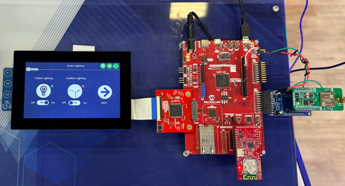  

[TOP](#contents)

## Software Setup
### Development Tools
  - MPLAB® X IDE v6.20
  - MPLAB® X IDE plug-ins: MPLAB® Code Configurator (MCC) v5.7.1 and above
  - MPLAB® XC32 C/C++ Compiler v4.60
  - MPLAB® Harmony v3
  - Device Library: 1.5.5
  - Device Pack: PIC32CZ-CA80_DFP (1.6.163)

### MCC Content Libraries
| Harmony V3 component | version |
| :------------------- | :------ |
| core                 | v3.15.3 |
| wireless_system_rnwf | v3.0.0  |
| wireless_wifi        | v3.12.0 |
| csp                  | v3.22.6 |
| filex                | v6.2.1  |
| CMSIS_5              | v5.9.1  |
| usb                  | v3.16.0 |
| littlefs             | v2.10.0 |
| gfx                  | v3.16.0 |
| smartenergy          | v1.4.0  |
| bsp                  | v3.22.0 |

### Harmony MCC Configuration

#### Full Configuration
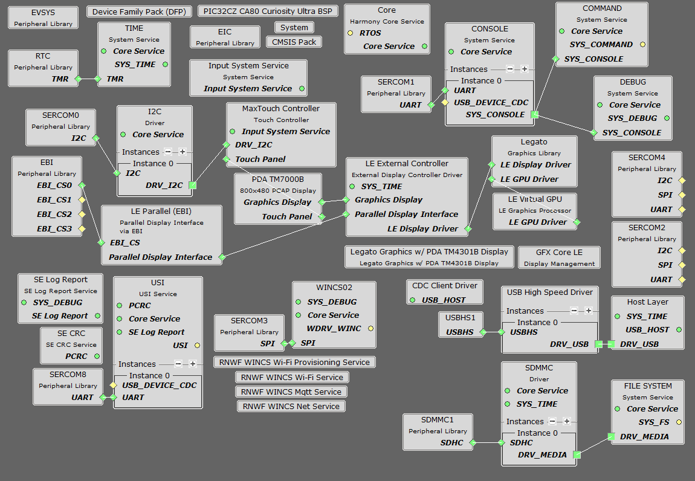

#### System Console, Debugging and Command Line Interface
The system console is configured to use SERCOM1 in USART mode and is accessible via the DEBUG USB connector.
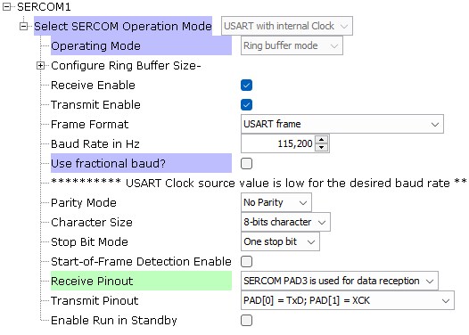

In addition to standard console functions, it supports debugging and provides a command line interface for direct interaction with the board.

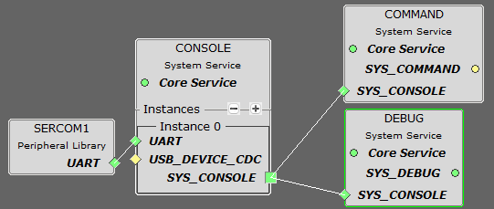

#### LCD Screen and Max Touch
The application manages an LCD screen connected via the EBI interface through an SD1369 controller. Touch functionality is enabled and controlled using SERCOM0 configured in I2C mode.

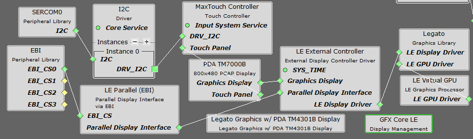

#### MicroSD Storage System
The application includes a mechanism to store information on a microSD card connected to the designated connector.

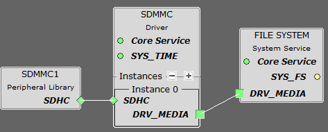

As a result of this configuration, SERCOM6 is dedicated to microSD communication and is not available for other purposes. The FAT file system has been selected for data storage.

#### WINCS02 Configuration
The application configures the WINCS02 module using SERCOM3 in SPI mode.

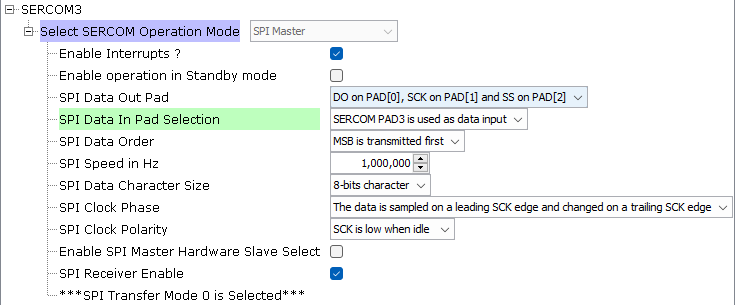

The WINCS02 module provides the following services:

- Wi-Fi connectivity for network access
- Wi-Fi provisioning (Access Point mode) to configure Wi-Fi connection parameters
- MQTT protocol support for connecting to cloud services

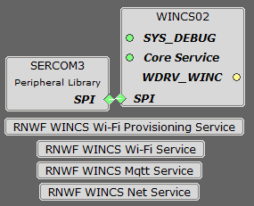

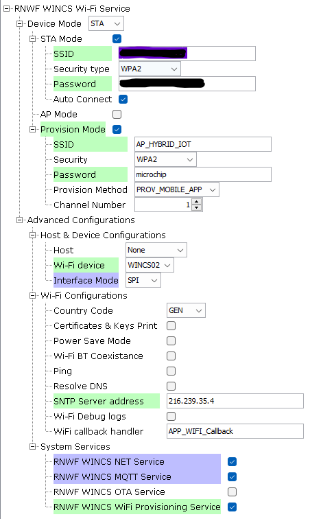

#### LTE Module Configuration
The application is able to configure a Sequance LTE module using the SERCOM4 in Serial Port mode.

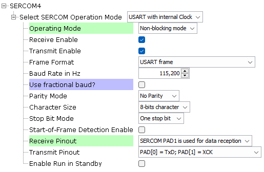

#### USI Serialization with WBZ451 Coordinator
The application manages communication with the WBZ451 Coordinator by utilizing SERCOM8 in Serial Port mode.

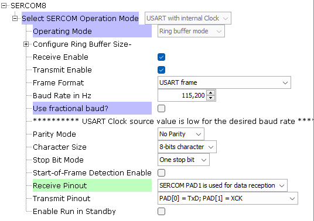

This communication is based on the USI (Universal Serial Interface) Service from Smart Energy. 

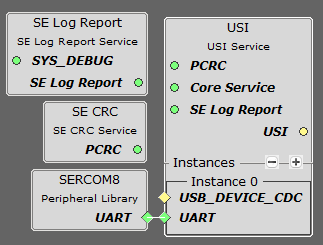

#### USB Host to supply power to WBZ451 Coordinator
The application is capable of supplying power to the WBZ451 Coordinator via the USB-C connector (USB1), which operates as a USB Host with VBUS support.

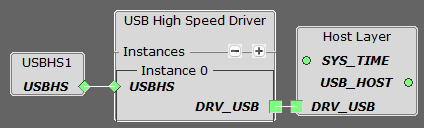
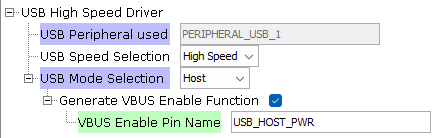

There is also an option, not currently implemented, to transfer the USI communication from SERCOM8 to the USB connection. To enable this functionality, HUB support must be activated in accordance with the hardware configuration of the WBZ451 Curiosity board.

[TOP](#contents)

### Application

<b>The main functionalities of the host controller include:</b>
- Receiving and requesting G3 network data from the G3 Coordinator
- Displaying G3 network data on the touch screen
- Controlling G3 devices via the touch screen interface
- Establishing cloud connectivity through Wi-Fi or LTE, accessible from the touch screen
- Presenting G3 network data on the IoT dashboard via Wi-Fi and/or LTE connection
- Controlling G3 devices from the IoT dashboard through Wi-Fi and/or LTE connection
- Displaying G3 network data on the command line interface
- Managing the G3 Coordinator and devices from the command line interface
- Printing debug data on the UART interface

#### G3 Hybrid devices

The G3 devices connected to the G3 Coordinator and managed by the host controller, along with their functionalities, are as follows::

| NAME            | DEVICE_TYPE | DEMO                   | FEATURE                        |
| :-              | :-          | :-                     | :-                             |
|Indoor Lighting  |0x10         |Smart Lighting Demo     |Controls the indoor light state |
|Outdoor Lighting |0x11         |Smart Lighting Demo     |Controls the outdoor light state|
|Liquid Detector  |0x13         |Sustainability Wall Demo|Monitors availability           |
|Solar Inverter   |0x14         |Sustainability Wall Demo|Monitors availability           |
|Battery Charger  |0x15         |Sustainability Wall Demo|Monitors availability           |
|Energy Storage   |0x16         |Sustainability Wall Demo|Monitors availability           |
|Heat Pump        |0x17         |Sustainability Wall Demo|Monitors availability           |
|EV Charger       |0x18         |Sustainability Wall Demo|Monitors availability           |
|Electricity Meter|0x19         |Sustainability Wall Demo|Monitors availability           |
|Emergency Button |0x1A         |Hybrid IoT BP           |Generate Alarms                 |
|LED Panel        |0x1B         |Hybrid IoT BP           |Controls LED Panel state        |

Each device is integrated into the G3 network and provides specific control or monitoring features as outlined above.

#### Host Controller applications

The Host Controller is structured around several application files, each responsible for specific functionalities:

- <b>app_coordinator</b>: Manages interaction and information exchange with the G3 Network via USI serialization with the G3 Coordinator.
- <b>app_wifi</b>: Handles Internet and Cloud connectivity over Wi-Fi using the Microchip WINCS02 device. 
- <b>app_lte</b>: Manages Internet and Cloud connectivity through an LTE-M/NB-IoT module from Sequans.
- <b>app_ui</b>: Serves as the interface between various applications and graphics-related modules, utilizing notification registration and a message queue for communication.
- <b>app_screen_main</b>:  Implements OnShow, OnHide, and OnUpdate event handling for the main touch screen interface.
- <b>app_screen_signaling</b>: Manages OnShow, OnHide, and OnUpdate events for the touch screen interfaces related to Emergency Button and LED Panel devices.
- <b>app_screen_swall</b>: Handles OnShow, OnHide, and OnUpdate events for devices featured in the Sustainability Wall Demo on the touch screen.
- <b>app_screen_lighting</b>: Manages OnShow, OnHide, and OnUpdate events for devices included in the Smart Lighting Demo on the touch screen.
- <b>app_interface</b>: Provides a command line interface for interacting with the G3 Coordinator and G3 network (via a queue in app_coordinator), and manages local information and features such as registered device data.

#### Communication Protocol between Host and G3 coordinator

The communication protocol between host and G3 coodinator runs over the USI Service serialization from <a href="https://github.com/Microchip-MPLAB-Harmony/smartenergy" target="_blank">Microhip MPLAB Harmony smartenergy repository</a>.

Communication is initiated when the G3 Coordinator sends a notification of a reset (under normal conditions) or a heartbeat (if an unmanaged reset occurs on the host). Following this event, the host controller begins to periodically request complete device information, typically every minute, to monitor device availability.

The ping mechanism operates by requesting the device type and awaiting a response from the device. If the device responds, it is considered active, and the host can then send additional commands to interact with it.

The communication protocol utilizes G3 Coordinator commands to manage and interact with G3 devices on the network. It also includes supplementary commands to handle and notify information or events reported by the G3 Coordinator.

| ID   | NAME                    | SOURCE | DESTINATION | FEATURE                                      |
| :--- | :---------------------- | :----- | :---------- | :------------------------------------------- |
| 0xF4 | GET_DEVICE_INFO         | HOST   | COORD       | Get the Device Type Information              |
| 0xF6 | SET_RGB_LED             | HOST   | COORD       | Set the RGB LED colour                       |
| 0xF8 | SET_RGB_LED_BLINK       | HOST   | COORD       | As previous blinking with a freq a while     |
| 0xFA | SET_PANEL_INFO          | HOST   | COORD       | Set the information shown in the Panel LED   |
| 0xFC | EMERGENCY               | COORD  | HOST        | Emergency Alarm received                     |
| 0xFE | SET_LIGHT               | HOST   | COORD       | Set the light state of a Lighting Device     |
| 0xE0 | CMD_GET_DEVICES         | HOST   | COORD       | Request Registered Devices to Coordinator    |
| 0xE1 | CMD_GET_DEVICES_ANSWER  | COORD  | HOST        | Answer to request                            |
| 0xE2 | CMD_DEVICE_NOTIFICATION | COORD  | HOST        | Change of device information                 |
| 0xE3 | CMD_RESET_NOTIFICATION  | COORD  | HOST        | Coordinator reset occured                    |
| 0xE4 | CMD_HEARTBEAT           | COORD  | HOST        | Coordinator heartbeat, received periodically |

#### Command Line Interface

The project includes a CLI with these commands:

| COMMAND      | PARAMS                                           | Description                                       |
| :-           | :-                                               | :-                                                |
|SET_LIGHT     |<X(dest)> <0-1>                                   |Set light 0:off, 1:on                              |
|SET_PANEL_INFO|<X(dest)> <0-1>                                   |Set Panel Led (0:Logo, 1:Alarm)                    |
|SET_RGB       |<X(dest)> <X(H)> <X(S)> <X(V)>                    |Set RGB Led colour - HSV Format                    |
|SET_RGBB      |<X(dest)> <X(H)> <X(S)> <X(V)> <X(freq)> <X(time)>|Set RGB Led Colour, Blink and Duration             |
|PING          |<X(dest)>                                         |Ping device X                                      |
|REGDEV        |None                                              |Show registered G3 devices                         |
|DBGLVL        |<0-4>                                             |Debug Level <Fatal,Error,Warning,Info,Debug>       |
|CRST          |None                                              |Resets the G3 Coordinator                          |
|POWER         |<0-1>                                             |Coordinator Power 0:off, 1:on                      |
|SET_WIFI      |<X(SSID)> <X(PWD)> <X(SEC)>                       |Sets WiFi Parameters ssid, pass and security (0-5) |
|GET_WIFI      |None                                              |Gets WiFi Parameters ssid, pass and security       |

where:
| Device          | X(dest) |
| :-              | :-      |
|Indoor Lighting  |0        |
|Outdoor Lighting |1        |
|Liquid Detector  |3        |
|Solar Inverter   |4        |
|Battery Charger  |5        |
|Energy Storage   |6        |
|Heat Pump        |7        |
|EV Charger       |8        |
|Electricity Meter|9        |
|Emergency Button |10       |
|LED Panel        |11       |

| Color | X(H) |
| :-    | :-   |
|Red    |00    |
|Yellow |2B    |
|Green  |55    |
|Cyan   |80    |
|Blue   |AA    |
|Magenta|D5    |

#### LCD Graphics Interface
The graphic interface is based on these elements:

##### System Status Icons

The system status is displayed in the upper-right corner of the screen and is represented by four icons, each indicating a specific operational status:

- <b>Alarm Status</b>: This icon appears when an alarm event occurs.

- <b>G3 Coordinator Status</b>: The icon displays "red" when the G3 Coordinator is not ready and "green" when it is operational.

- <b>Wifi Connection Status</b>: The icon is "red" if the WINCS02 module is not ready, "yellow" when searching for a Wi-Fi network, and "green" when a connection is established.

- <b>Cloud Connection Status</b>: The icon is "red" when Wi-Fi is not ready, "yellow" when Wi-Fi is ready and the system is attempting to connect to the cloud, and "green" when the cloud connection is established.

##### Main Screen
At start-up, the main screen is displayed. To proceed to the next screen, press the Start button.

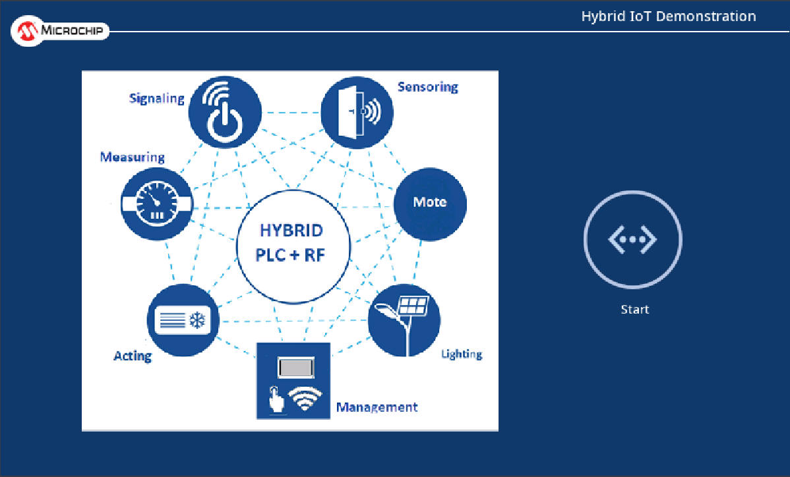

#### Emergency Systems Screen
The Emergency System screen provides controls for the Emergency Button and Panel LED devices.

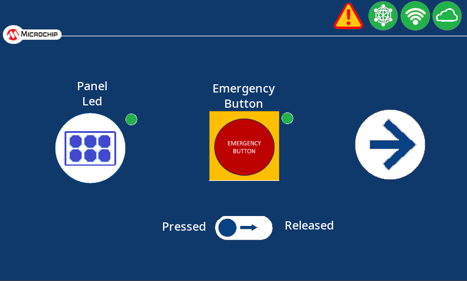

Device availability is indicated by the color of the small circle next to each device:

- <b>Red</b>: device is disconnected
- <b>Yellow</b>: device has joined but its type has not yet been received
- <b>Green</b>: device is available

When the device picture button is pressed, the system sends a command to the corresponding device (if available) to activate the LED and initiate blinking for 10 seconds.

Pressing the pressed-released switch generates an Alarm command, simulating the action of pressing the Emergency Button.

To navigate to the next screen, press the "Next" button.

##### Sustainability Wall Screen
The Sustainability Wall screen enables interaction with devices featured in the Sustainability Wall Demo.

By pressing a device picture button, the system sends a command to the selected device (if available) to activate the RGB LED in cyan and initiate blinking for 10 seconds.

To proceed to the next screen, press the "Next" button.

##### Smart Lighting Screen

The Smart Lighting screen provides control over devices included in the Smart Lighting Demo:

- Indoor Lighting
- Outdoor Lighting

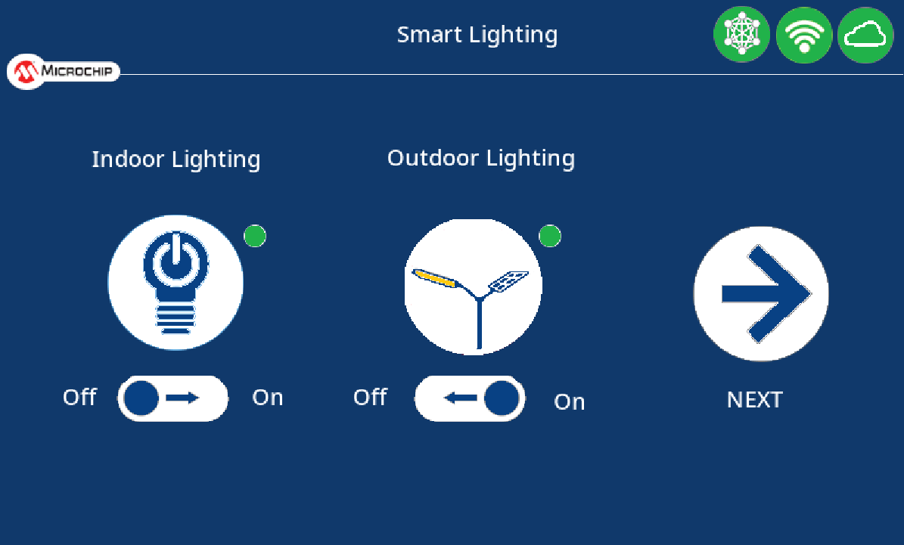

Pressing a device picture button sends a command to the selected device to activate the RGB LED in cyan and initiate blinking for 10 seconds.

Using the on-off switch, you can send a command to the corresponding device to toggle the light on or off.

To move to the next screen, press the "Next" button.

#### Cloud Connection
The MQTT broker used for this demo is KaaIoT, and the corresponding dashboard is shown below:
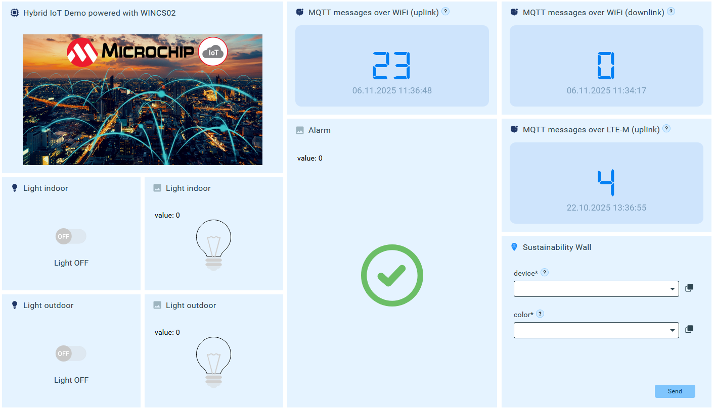

All the MQTT connection parameters (including the broker URL, authentication credentials and topics for subscription and publication) are configured in [configuration.h](./firmware/src/config/lcc_rgb565_mxt_cz_ca80_cu/configuration.h#L92).

##### Wi-Fi Connection

Wi-Fi connectivity is managed using the WINCS02 Add-On Board. Upon powering up the host, the device automatically initializes, establishes a Wi-Fi connection, and connects to the MQTT broker. By subscribing to relevant topics, the device can receive data from the broker, while publishing topics enables it to send data.  

Wi-Fi credentials can be updated using the following methods:
- Modify the hard-coded default credentials [configuration.h](./firmware/src/config/lcc_rgb565_mxt_cz_ca80_cu/configuration.h#L320)
- Use Wi-Fi provisioning, which starts automatically if the connection with default credentials cannot be established:
  - connect to the SSID 'AP_HYBRID_IOT' with the password 'microchip' using a mobile phone
  - use the 'Wi-Fi Provisioning' app from Microchip
  - enter the Server IP Address: 192.168.1.1 and Port: 80, then connect
  - Select the desired Wi-Fi network, enter the password, and submit.
- Insert a microSD card containing a file named wifiCfg.txt with the format: "ssid=XXX,key=XXX,sec=X".
  
If a microSD card is present, any credentials entered during Wi-Fi provisioning are also saved to the microSD card and will be used on the next system reset.

##### LTE Connection

LTE connection is established using the LTE IoT 10 Click board. After powering up the host, the device initializes automatically, registers on the network and connects to the MQTT broker. By subscribing to relevant topics, the device can receive data from the broker, while publishing topics allows it to send data.

[TOP](#contents)

## Board Programming
Programming the application can be done using MPLAB X IDE
- Open the given project using MPLAB X IDE
- Select the connected hardware tool in the project properties
- Make and program device

[TOP](#contents)

## Run the demo

Connect all devices to the G3 network and switch on the Blue Panel power supply.
Wait for the devices to register; the connection icon will turn green for each device as it becomes available on the network.

You can interact with the devices by pressing their icons, toggling lighting devices on or off, or generating alarms by pressing the Emergency Button or the corresponding button on the screen.

<b>UART interface</b>  
For debugging purposes and access to the command line, a UART interface to the PC is implemented. A serial port terminal (e.g. PuTTY) can be used to open a connection to the device.  
  
USART configuration:
- Baud rate: 115 200 Hz
- Parity mode: no parity
- Stop bit mode: 1 Stop bit

[TOP](#contents)

## Links

More information about the Hardware can be found on:
- [PIC32CZ CA80 Datasheet](https://ww1.microchip.com/downloads/aemDocuments/documents/MCU32/ProductDocuments/DataSheets/PIC32CZ-CA80-CA90-Family-Data-Sheet-DS60001749.pdf)
- [PIC32CZ CA80 Curiosity Ultra Development Board](https://www.microchip.com/en-us/development-tool/ev51s73a)
- [PIC32CZ CA80 Curiosity Ultra Development Board User Guide](https://ww1.microchip.com/downloads/aemDocuments/documents/MCU32/ProductDocuments/UserGuides/PIC32CZ-CA80-CA90-Curiosity-Ultra-User-Guide-DS70005522.pdf)
- [WINCS02 WiFi Module Datasheet](https://ww1.microchip.com/downloads/aemDocuments/documents/WSG/ProductDocuments/DataSheets/WINCS02-Wi-Fi-Module-Data-Sheet-DS70005577.pdf)
- [WINCS02 Add-on Board](https://www.microchip.com/en-us/development-tool/ev68g27a)
- [WINCS02 Add-on Board User Guide](https://ww1.microchip.com/downloads/aemDocuments/documents/WSG/ProductDocuments/UserGuides/WINCS02-Add-On-Board-Users-Guide-DS50003721.pdf)
- [LTE IoT 10 Click](https://www.mikroe.com/lte-iot-10-click)
- [WVGA LCD Display with MaxTouch](https://www.microchip.com/en-us/development-tool/ac320005-5)
- [WVGA LCD Display with MaxTouch User Guide](https://ww1.microchip.com/downloads/aemDocuments/documents/OTH/ProductDocuments/Brochures/50002681B.pdf)
- [SSD1963 LCD Controller Graphics Card](https://www.microchip.com/en-us/development-tool/ac320214)
- [SSD1963 LCD Controller Graphics Card Information](https://ww1.microchip.com/downloads/en/DeviceDoc/SSD1963_LCD_Controller_%20Graphics_Card_DS50002915A.pdf)

More information about the Sustainability Wall reference designs configured as G3 devices can be found on:

- [Liquid Detection Reference Design](https://www.microchip.com/en-us/development-tool/EV24U22A)
- [Solar Microinverter Reference Design](https://www.microchip.com/en-us/tools-resources/reference-designs/grid-connected-solar-microinverter)
- [Solar MPPT Battery charger Reference Design](https://www.microchip.com/en-us/tools-resources/reference-designs/solar-mppt-battery-charger-reference-design)
- [Energy Storage Reference Design](https://www.microchip.com/en-us/tools-resources/reference-designs/high-voltage-auxiliary-e-fuse-reference-design)
- [Heat Pump Reference Design](https://www.microchip.com/en-us/tools-resources/reference-designs/11-kw-totem-pole-demonstration-application)
- [EV Charger Reference Design](https://www.microchip.com/en-us/tools-resources/reference-designs/three-phase-ac-commercial-with-ocpp-and-display-electric-vehicle-charger-reference-design)
- [Electricity Meter Reference Design](https://www.microchip.com/en-us/development-tool/EV58E84A)

[TOP](#contents)
